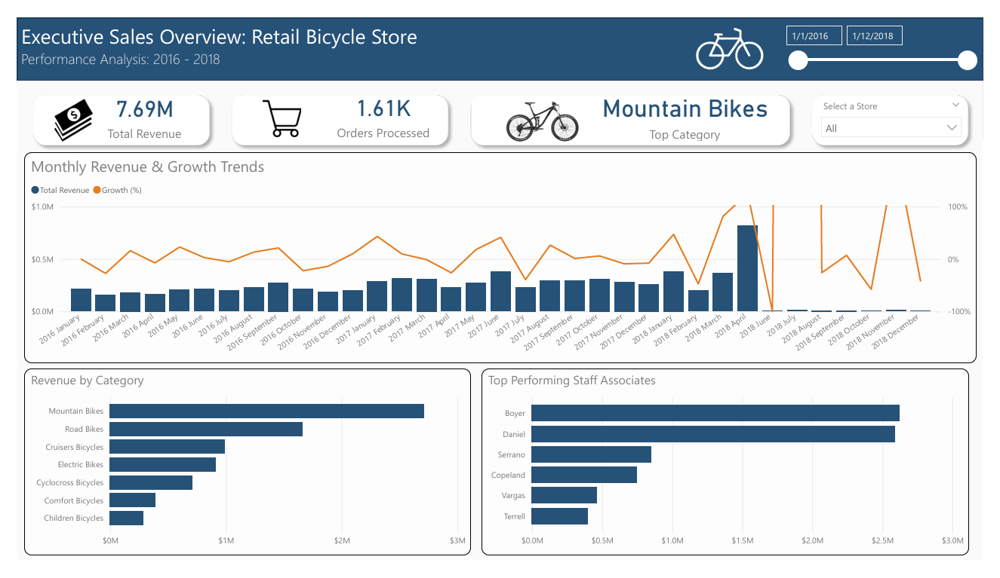

**Project Status:** Completed (Dec 2025)

# 🚲 Bicycle Store Sales Analysis

### Project Overview
This project involves a full-stack data analysis of a retail bicycle store's performance from 2016 to 2018. The goal was to transform raw relational database data into an interactive executive dashboard to track revenue trends, staff performance, and inventory efficiency.

**Live Dashboard Preview:**


### Tech Stack
* **SQL (MySQL):** Data extraction, cleaning, and complex transformation.
* **Power BI:** Data modelling, DAX measures, and interactive visualisation.
* **Data Modelling:** Star Schema design.

### Repository Structure
* **`SQL_Scripts/`**:
    * `1_database_setup.sql`: Schema creation and relational integrity constraints.
    * `2_exploratory_analysis.sql`: **(Recommended)** Contains the raw queries used to investigate data quality, test joins, and validate logic before production.
    * `3_final_views.sql`: The optimised SQL Views used to feed the Power BI dashboard.
* **`PowerBI/`**: The `.pbix` source file.
* **`Assets/`**: Dashboard screenshots and diagrams.

### Key Business Insights
* **Revenue Growth:** Identified a seasonal sales pattern where revenue peaks in Q2 (April-June), with "Mountain Bikes" driving the majority of sales.
* **Staff Performance:** The top 2 sales associates (Boyer and Daniel) contribute disproportionately to total revenue, suggesting a potential mentorship opportunity for lower-performing staff.
* **Sales Volatility:** While annual revenue is growing, month-over-month growth rates remain volatile (-20% to +20%), indicating a need for more consistent off-season marketing strategies.

### Technical Challenges & Solutions

#### 1. SQL Advanced Logic
Instead of simple aggregations, I used **Window Functions** and **CTEs** to engineer complex metrics directly in the database.
* *Challenge:* Calculating Month-over-Month (MoM) growth in SQL.
* *Solution:* Used `LAG() OVER (ORDER BY date)` to retrieve the previous month's revenue and compare it to the current month in a single query.

```sql
-- Snippet from 3_final_views.sql
LAG(total_revenue) OVER (ORDER BY order_year, order_month) AS previous_revenue,
-- Calculation handling potential division by zero
IFNULL(
    (total_revenue - LAG(total_revenue) OVER (...)) / LAG(...) * 100, 
0) AS growth_percentage
```

#### 2. PowerBI Data Modelling
**Date Handling:** Merged split Year/Month columns from SQL into a unified Date hierarchy in Power BI to enable continuous time-series analysis.

**Data Skew:** Handled massive growth outliers (e.g., store launch months with 5000% growth) by implementing logical filtering and axis-clamping to ensure the visual narrative focused on sustainable growth trends.

**Interactive Slicers:** Built a dynamic "Store Slicer" allowing executives to drill down into specific store performance without leaving the main view

Created by Wong Jung Yong
